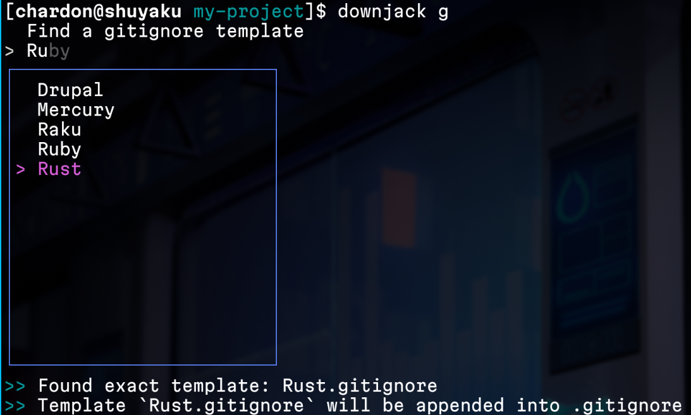

# downjack

A simple ~down jacket~ developer helper tool.



It can set up `.gitignore` and licenses in your projects with damn-fast speed.

## Usage

For example, if you want to set up `.gitignore` for a Go project:

```bash
downjack gitignore go
# OR simply
downjack g go
# OR fuzzy find
downjack g
```

> [!NOTE]
>
> The fuzzy finder supports basic Emacs key binds :)

then create a license file with `MIT` license:

```bash
downjack license mit
# OR simply
downjack l mit
# OR again fuzzy find
downjack l
```

and that's it, your project is now ready to work with!

## Install 

> More installation methods are coming!

### Binary

Go to the [release page](https://github.com/chardoncs/downjack/releases) and find the binary for your OS.

### Arch Linux (btw)

We provide AURs
([`downjack`](https://aur.archlinux.org/packages/downjack)
and
[`downjack-bin`](https://aur.archlinux.org/packages/downjack-bin))
for Arch users.

For convenience, you may use an AUR helper:

```bash
yay -S downjack-bin
# OR
paru -S downjack-bin
```

### Go

```bash
go install go.chardoncs.dev/downjack@latest
```

## Supported templates

<details>
<summary>Gitignores</summary>

> Templates from [GitHub gitignore](https://github.com/github/gitignore)

- Ada
- Android
- Angular
- Ballerina
- C++
- C
- CMake
- CUDA
- CakePHP
- ChefCookbook
- Clojure
- CodeIgniter
- CommonLisp
- Composer
- Concrete5
- Coq
- CraftCMS
- D
- DM
- Dart
- Delphi
- Dotnet
- Drupal
- EPiServer
- Eagle
- Elisp
- Elixir
- Elm
- Erlang
- ExpressionEngine
- ExtJs
- Fancy
- Finale
- Firebase
- FlaxEngine
- Flutter
- ForceDotCom
- Fortran
- FuelPHP
- GWT
- Gcov
- GitBook
- GitHubPages
- Gleam
- Go
- Godot
- Gradle
- Grails
- HIP
- Haskell
- Haxe
- IAR
- IGORPro
- Idris
- JBoss
- JENKINS_HOME
- Java
- Jekyll
- Joomla
- Julia
- Katalon
- KiCad
- Kohana
- Kotlin
- LabVIEW
- LangChain
- Laravel
- Leiningen
- LemonStand
- Lilypond
- Lithium
- Lua
- Luau
- Magento
- Makepkg.AllowList
- Makepkg
- Maven
- Mercury
- MetaProgrammingSystem
- ModelSim
- Modelica
- Nanoc
- Nestjs
- Nextjs
- Nim
- Nix
- Node
- OCaml
- Objective-C
- Opa
- OpenCart
- OracleForms
- Packer
- Perl
- Phalcon
- PlayFramework
- Plone
- Prestashop
- Processing
- PureScript
- Python
- Qooxdoo
- Qt
- R
- README
- ROS
- Racket
- Rails
- Raku
- ReScript
- RhodesRhomobile
- Ruby
- Rust
- SCons
- SSDT-sqlproj
- Salesforce
- Sass
- Scala
- Scheme
- Scrivener
- Sdcc
- SeamGen
- SketchUp
- Smalltalk
- Solidity-Remix
- Stella
- SugarCRM
- Swift
- Symfony
- SymphonyCMS
- TeX
- Terraform
- TestComplete
- Textpattern
- TurboGears2
- TwinCAT3
- Typo3
- Unity
- UnrealEngine
- VBA
- VVVV
- VisualStudio
- Waf
- WordPress
- Xojo
- Yeoman
- Yii
- ZendFramework
- Zephir
- Zig
</details>

<details>
<summary>Licenses</summary>

- `0BSD`
- `AGPL-3.0`
- `Apache-2.0`
- `BSD-1-Clause`
- `BSD-2-Clause`
- `BSD-3-Clause`
- `FSL-1.1-MIT` (Markdown)
- `GPL-2.0`
- `GPL-3.0`
- `LGPL-2.0`
- `LGPL-3.0`
- `MIT`
- `MPL-2.0`
- `OSL-3.0`
- `PostgreSQL`
- `Unlicense`
- `WTFPL`
- `zlib`
</details>

## Tips

It may be useful to add an alias for `dj` to your shell config (pun intended 📀🤘)

```bash
alias dj='downjack'
```
